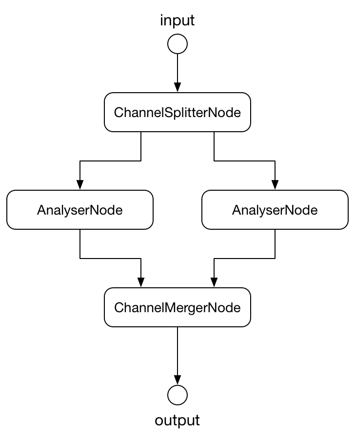

# StereoAnalyserNode
[](https://travis-ci.org/mohayonao/stereo-analyser-node)
[](https://www.npmjs.org/package/stereo-analyser-node)
[](http://mohayonao.mit-license.org/)

## Installation

```
npm install stereo-analyser-node
```

#### downloads:

- [stereo-analyser-node.js](https://raw.githubusercontent.com/mohayonao/stereo-analyser-node/master/build/stereo-analyser-node.js)
- [stereo-analyser-node.min.js](https://raw.githubusercontent.com/mohayonao/stereo-analyser-node/master/build/stereo-analyser-node.min.js)

## Quick Example

```js
const StereoAnalyserNode = require("stereo-analyser-node");

const audioContext = new AudioContext();
const analyser = new StereoAnalyserNode(audioContext);
const arrayL = new Float32Array(1024);
const arrayR = new Float32Array(1024);

analyser.getFloatFrequencyData(arrayL, arrayR);
```

## Demo

http://mohayonao.github.io/stereo-analyser-node/

## API
### StereoAnalyserNode
  - `constructor(audioContext: AudioContext, opts = {})`
    - `opts.fftSize: number`
    - `opts.minDecibels: number`
    - `opts.maxDecibels: number`
    - `opts.smoothingTimeConstant: number`

#### Instance Attributes
  - `fftSize: number`
  - `frequencyBinCount: number` _readonly_
  - `minDecibels: number`
  - `maxDecibels: number`
  - `smoothingTimeConstant: number`

#### Instance Methods
  - `connect(destination: AudioNode|AudioParam): void`
  - `disconnect(): void`
  - `getFloatFrequencyData(arrayL: Float32Array, arrayR: Float32Array): void`
  - `getByteFrequencyData(arrayL: Uint8Array, arrayR: Uint8Array): void`
  - `getFloatTimeDomainData(arrayL: Float32Array, arrayR: Float32Array): void`
  - `getByteTimeDomainData(arrayL: Uint8Array, arrayR: Uint8Array): void`

## AudioGraph



## License

MIT
